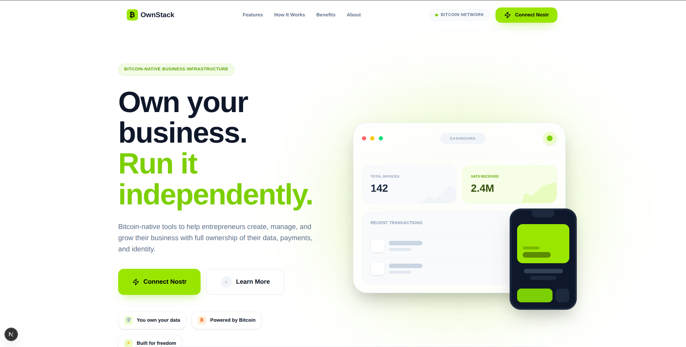
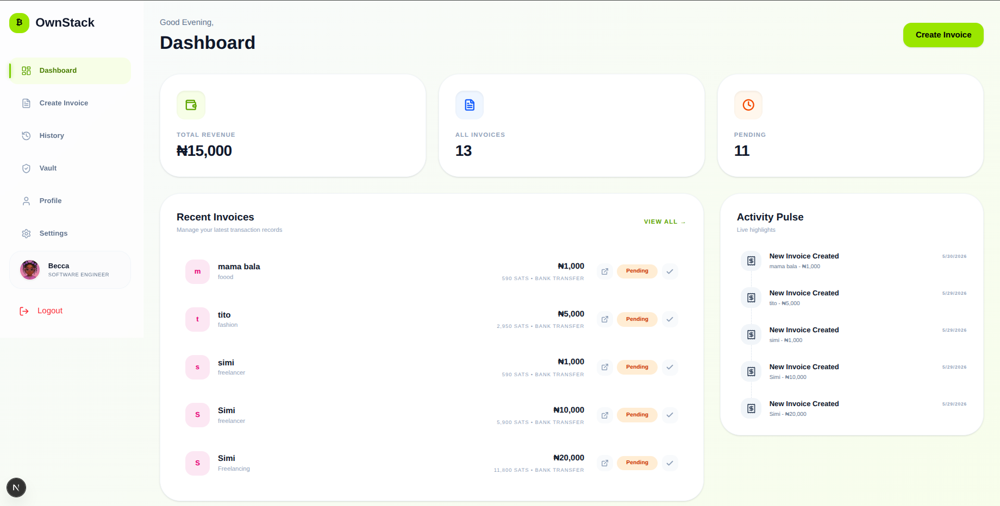

# OwnStack

**Bitcoin-Native Business Infrastructure for Entrepreneurs and Informal Businesses**

## Overview

OwnStack is a Bitcoin-native business infrastructure platform that helps entrepreneurs and informal businesses create portable business identities, generate invoices, receive payments, and maintain ownership of their business records.

Many small businesses rely heavily on WhatsApp, Instagram, and manual record keeping. This often leads to lost invoices, poor payment tracking, and dependence on centralized platforms. OwnStack provides a lightweight and freedom-focused alternative that combines Bitcoin, Lightning, and Nostr technologies.

---

## Problem

Entrepreneurs and informal businesses face several challenges:

* Lost invoices and receipts
* Poor payment tracking
* No portable business identity
* Dependence on centralized platforms
* Difficulty proving transaction history
* Lack of ownership over business records
* Limited access to trustworthy business infrastructure

These challenges are especially common among small business owners, freelancers, creators, vendors, and women-led businesses.

---

## Solution

OwnStack enables users to:

* Create a portable business profile
* Generate professional invoices
* Receive Lightning-enabled payments
* Track invoice and payment status
* Maintain ownership of business records
* Build verifiable business history
* Recover business data through self-sovereign identity

By combining Bitcoin and Nostr, OwnStack gives entrepreneurs greater control over their digital business presence.

---

## Key Features

### Business Identity

* Create and manage business profiles
* Upload business information
* Generate a portable business identity

### Invoice Generator

* Create invoices for customers
* Track invoice status
* Share invoice links
* Generate payment requests

### Payment Tracking

* Monitor paid and pending invoices
* View business revenue summaries
* Maintain transaction history

### Nostr Authentication

* Self-sovereign login
* User-owned identity
* Reduced dependence on centralized authentication systems

### Bitcoin & Lightning Integration

* Lightning-ready payment workflow
* Bitcoin-native infrastructure
* Fast and borderless payment support

---

## How It Works

1. User signs in using Nostr.
2. User creates a business profile.
3. User generates an invoice.
4. Customer receives payment instructions.
5. Payment status is tracked.
6. Business records remain accessible through the user's identity.

---

## Tech Stack

### Frontend

* Next.js
* React
* Tailwind CSS
* TypeScript

### Backend

* FastAPI
* Python

### Database

* Supabase

### Identity Layer

* Nostr
* nostr-tools

### Bitcoin Layer

* Lightning Network
* Bitnob
* WebLN

---

## Freedom-Tech Alignment

OwnStack aligns with Hack4Freedom's mission by promoting:

* Self-sovereign identity
* Financial freedom
* User-owned records
* Open protocols
* Censorship resistance
* Portable business infrastructure

Instead of locking users into a platform, OwnStack helps entrepreneurs own their identity, records, and payment history.

---

## Target Users

* Women entrepreneurs
* Small business owners
* Freelancers
* Online vendors
* Creators
* Informal businesses
* Market traders

---

## Future Roadmap

* SMS and offline access
* Improved Lightning settlement
* Portable reputation system
* Business credit history exports
* Mobile application
* Enhanced Nostr-based record recovery

---

## Team

### Rebecca Oyeyiola

Frontend Developer

### Toluwani

Backend & Payment Integrations

---

## Repository

GitHub: https://github.com/oyeyiolarebecca/Ownstack

---

## Hack4Freedom Lagos 2026

OwnStack was built for Hack4Freedom Lagos 2026 to demonstrate how Bitcoin, Lightning, and Nostr can empower entrepreneurs with portable business infrastructure, financial visibility, and ownership of their digital records.
